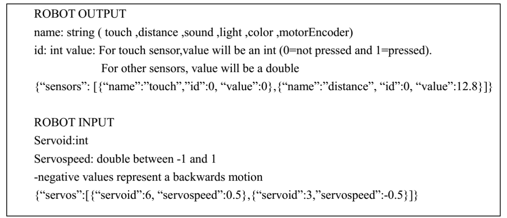
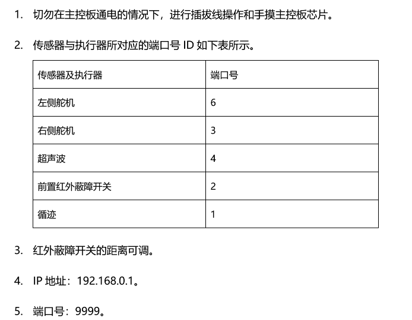

# Smart cars

[Go to the Go version](https://github.com/DrinkLessMilkTea/robot_car)

## Environment Setup

- Python 3.11
- No additional requirements

## How to Start

```sh
python -m src
```

**Or just press F5 in VSCode.**

## API Documentation

### General Car Class

File: `src/car.py`

- `Car()`: Create an instance
- `connect()`: Asynchronously connect to the car's WiFi with tcp
- `update_state()`: Asynchronously update the car's state
- `set_speed(...)`: Set the car's speed
- `distance`: Distance to an obstacle
- `in_road`: Whether the car is on the correct path
- `have_obstacle`: Whether there is an obstacle ahead (based on infrared signals)

### Minimal Demo

```py
from src.car import Car
from src.logging_config import setup_logging
import logging
from src.config import Config
import asyncio
logger = logging.getLogger(__name__)
# @attention await sleep some times is necessary to release thread for other coroutine.
async def control_car(car: Car):
  car.set_speed(0.5, 0.5)
  while True:
    print(f"current state: {car.distance}, {car.in_road}, {car.have_obstacle}")
    if car.distance is None or car.in_road is None or car.speed is None:
      await asyncio.sleep(0.1)
      continue
    if car.distance < 20:
      print("change state")
      car.set_speed(0.5, 0.0)
    else:
      print("change state")
      car.set_speed(0.5, 0.5)
    await asyncio.sleep(0.1)

async def main():
  setup_logging()
  car = Car()
  await car.connect()
  await asyncio.gather(
    car.update_state(),
    control_car(car)
  )

if __name__ == "__main__":
  logger.setLevel(Config.LOG_LEVEL)
  asyncio.run(main())
  print("done")
```

### Intelligent Car

File: `src/robot_craft_car.py`

- `class RobotCraftCar(Car)`: Further encapsulation for car
some example
```py
from src.car import Car
from enum import Enum
from typing import Callable
import asyncio
class Direction(Enum):
  LEFT = "left"
  RIGHT = "right"

class RobotCraftCar(Car):
  def __init__(self):
    super().__init__()
  def straight(self):
    self.set_speed(0.2,0.2)
  def low_straight(self):
    self.set_speed(0.2,0.2)
  def turn_left(self):
    self.set_speed(-0.1,0.1)
  def turn_right(self):
    self.set_speed(0.1,-0.1)
  async def adjustment_dir(self, dir:Direction, duration:float, is_right_gesture:Callable):
    time_left = duration
    if (dir == Direction.LEFT):
      self.turn_left()
    else:
      self.turn_right()
    while time_left > 0:
      if is_right_gesture():
        break
      time_left -= 0.1
      await asyncio.sleep(0.1)
    self.straight()
```
### Example Usage

```py
from src.robot_craft_car import RobotCraftCar as Car, Direction
from src.logging_config import setup_logging
import logging
from src.config import Config
import asyncio

logger = logging.getLogger(__name__)

async def control_car(car: Car):
  car.set_speed(0.3, 0.3)
  while True:
    print(f"current state: {car.distance}, {car.in_road}, {car.have_obstacle}")
    if car.distance is None or car.in_road is None or car.speed is None:
      await asyncio.sleep(0.1)
      continue
    if not car.in_road:
      await car.adjustment_dir(Direction.RIGHT, 1, lambda: car.in_road)
    if car.distance < 20:
      print("change state")
      await car.adjustment_dir(Direction.RIGHT, 1, lambda: car.distance is not None and car.distance > 40)
    await asyncio.sleep(0.1)

async def main():
  setup_logging()
  car = Car()
  await car.connect()
  await asyncio.gather(
    car.update_state(),
    control_car(car)
  )

if __name__ == "__main__":
  logger.setLevel(Config.LOG_LEVEL)
  asyncio.run(main())
  print("done")
```

## Communication Protocol



